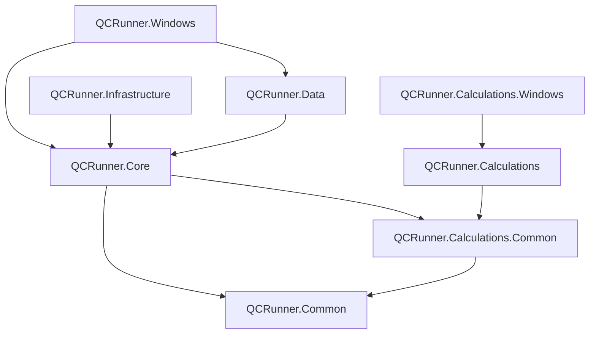

# QCRunner

The back end of a laboratory QC application, cut down to the parts that show how the solution
is put together: how an analytic method is built from operations, how a batch runs that method
against a plate reader and a pipetting robot, and how instrument data flows into the
calculation engine and comes back as results.

## How this repository came about

I used Claude to extract and redact some code from a QC application I built in a previous
role: code I thought was neat, isolated and a fair showcase of how I write and structure a
solution. It is loosely based on that work, made more generic and abstract so that I can use it
in interviews. In the interests of expediency I had Claude do the extraction, upgrade it to
.NET 10 and apply some formatting changes. The code structure, in terms of the project layout,
which projects reference which and the structure of the code itself, is untouched, and I am
happy to walk through any of it. All of the UI components have been stripped out; what is here
is essentially the back-end code, with the unit tests omitted.

The proprietary calculation algorithms are redacted. Every test in the calculation engine keeps
its shape, inputs and result building, but the arithmetic in the middle is a placeholder.

## What the application does

The application automates the release testing of a production batch. A batch is tested with an
analytic **method** that describes, step by step, what the instruments do and what is
calculated from the data they produce. A method is a tree:

```
Method              e.g. "FDG release testing"
 └─ Phase           an operator-started stage: Preparation, Cold, Hot
     └─ OperationGroup   a named run of related steps: "Colour, clarity and pH"
         └─ Operation    one step for one device or service
```

There are five kinds of operation:

| Kind | Examples | Goes to |
|---|---|---|
| Reader | absorbance read, luminescence count, shake, heat to temperature | the plate reader |
| Robot | aspirate, dispense, heat a nest | the pipetting robot |
| Calculation | colour, clarity, pH, endotoxin, ethanol, kryptofix, half-life, concentration, radiochemical purity and identity | the calculation engine |
| Prompt | "Load the plate and press OK" | the operator |
| Pause | wait for an incubation | a timer |

Running a batch means walking that tree in order. Each phase is queued into the operation
runner and executed one operation at a time. Between phases the operator is asked to confirm
that the plates and samples for the next phase are in place, which is where the hardware sits
idle while a sample is added or a plate is swapped.

Reader operations produce data per well. Calculation operations name the wells they need and
the role each well plays (sample, standard, background). When a calculation runs, the reader
data collected so far is looked up for those wells, converted into the engine's input types
and handed to the calculation engine together with the acceptance criteria stored on the
operation. The engine returns a result object: pass or fail, the measured value and its unit,
the value formatted for the report, the acceptance criteria as text, and the charts and tables
the results screen shows. If a calculation asks for a well that has not been read, the batch
reports insufficient data and stops the phase rather than guessing.

## Solution layout

| Project | Purpose |
|---|---|
| `QCRunner.Common` | Cross-cutting helpers shared by every assembly |
| `QCRunner.Calculations.Common` | The calculation contracts shared between the engine and the application: enumerations, well inputs, parameters, result and chart interfaces, `ICalculationEngine` |
| `QCRunner.Calculations` | The calculation engine: one test class per QC test (redacted), result objects, result building, units of measure and specification limits |
| `QCRunner.Core` | The domain: methods, phases, groups, operations, batches and labware; the instrument interfaces; the reader data store; the runners |
| `QCRunner.Data` | Entity Framework Core persistence over SQLite: entity configurations, repositories, database creation and seeding of two example methods |
| `QCRunner.Infrastructure` | The instruments: the vendor-backed reader and robot, their simulation counterparts, the vendor SDK adapters, and the simulated batch runner |
| `QCRunner.Windows` | Method designer shell (placeholder, no UI work) |
| `QCRunner.Calculations.Windows` | Raw calculation data viewer shell (placeholder, no UI work) |



Dependencies point inwards only. `Core` knows the calculation engine solely through
`ICalculationEngine`, so the engine assembly is referenced only by the applications that
compose it. `Data` and `Infrastructure` both depend on `Core` and never on each other: they
change for different reasons and are consumed by different applications (the calculation
viewer needs persistence but no instruments; a simulation build needs instruments but no
vendor SDKs).

## Where to start reading

1. `Core/Methods` and `Core/Operations`: the method tree and the operation classes. Every
   operation is its own class with only its own properties; `OperationBase` carries the common
   name, description and ordering.
2. `Core/Runners/BatchRunner.cs`: how a batch walks the phases, queues each phase's groups and
   confirms the next phase with the operator.
3. `Core/Runners/OperationRunner.cs`: how one operation is routed to the reader, robot,
   calculation processor or prompt service, how the queue is drained, and how pause and
   cancellation work.
4. `Core/ReaderData`: the in-memory store the reader feeds and the calculations read from,
   including `InsufficientWellDataException`.
5. `Core/Calculations/CalculationProcessor.cs`: the conversion from reader data to the
   engine's wells and parameters.
6. `Calculations/Engine`: the engine entry point, the test base classes and the reflection-based
   `TestProvider`. Then any test in `Calculations/Tests` and its result class in
   `Calculations/Results` to see how a result is assembled from charts, tables, units and
   specification limits.
7. `Infrastructure/Instruments/InstrumentBase.cs` and `Infrastructure/Readers/HidexReader.cs`:
   how commands are serialised, logged and translated into vendor SDK calls, with the SDK
   behind an adapter interface.
8. `Data/Configurations` and `Data/Seeding`: the EF Core mapping (table-per-hierarchy for
   operations) and the two seeded methods, which double as worked examples of a method.

## Notes for reviewers

- **Keeping the UI responsive.** Every instrument call returns a `Task`; a batch runs on the
  thread pool and the UI awaits `RunAsync`. Runner events are raised on the batch thread and a
  form marshals them with `Invoke`. Prompts go through `IPromptService`, whose WinForms
  implementation does the same. Pause is a flag the queue loop checks between operations,
  because an instrument command cannot be suspended half way through.
- **Thread-safe hardware.** `InstrumentBase` serialises every command behind a `SemaphoreSlim`,
  checks the connection, and logs the start, finish and failure of each command. Vendor SDKs
  sit behind small adapter interfaces (`IHidexSenseApi`, `ISoloApi`); the SDKs themselves are
  not distributed, so `HidexSenseApiStub` and `SoloApiStub` stand in for them.
- **Simulation.** `SimulationReader` and `SimulationRobot` need no hardware and return
  well-formed data that produces passing calculations. `SimulatedBatchRunner` is a
  `BatchRunner` that brings its own simulated instruments, for exhibitions and training.
- **Persistence.** Operations are stored in one table (table-per-hierarchy, string
  discriminator) and materialise as their concrete types, so the runners switch on the CLR type.
  Navigation properties are `virtual` and lazy loading proxies are on, so a method is loaded
  with one query and its phases, groups and operations load as the runner reaches them.
  `DatabaseInitializer` creates the SQLite file and seeds the example methods on first use.
- **What is redacted.** `RedactedCalculation` returns the mean of the input signal where the
  real algorithm used to be, and each test compares that against `LowerLimit` and `UpperLimit`
  parameters. The numbers are meaningless by design; the structure around them is not.
- **What is left out.** The UI, the unit tests, HPLC operations, barcode scanning, audit trails,
  signatures, users and permissions, and the CSV and XML exports.

## Building

Requirements: the .NET 10 SDK. Visual Studio 2022 17.14 or later (or Rider) opens the
`QCRunner.slnx` solution file.

```bash
dotnet build QCRunner.slnx
```

Running a batch from an application looks like this:

```csharp
Batch batch = new() { Reference = "FDG-001", Method = await methods.GetByCodeAsync("FDG") };

IBatchRunner runner = simulation
    ? new SimulatedBatchRunner(batch, calculationProcessor, promptService, loggerFactory)
    : new BatchRunner(batch, new OperationRunner(reader, robot, calculationProcessor, promptService, new ReaderDataStore(), logger), promptService, logger);

runner.OperationCompleted += (_, e) => { /* update the screen */ };
runner.BatchCompleted += (_, e) => { /* show e.CalculationResults */ };

await runner.RunAsync();
```
